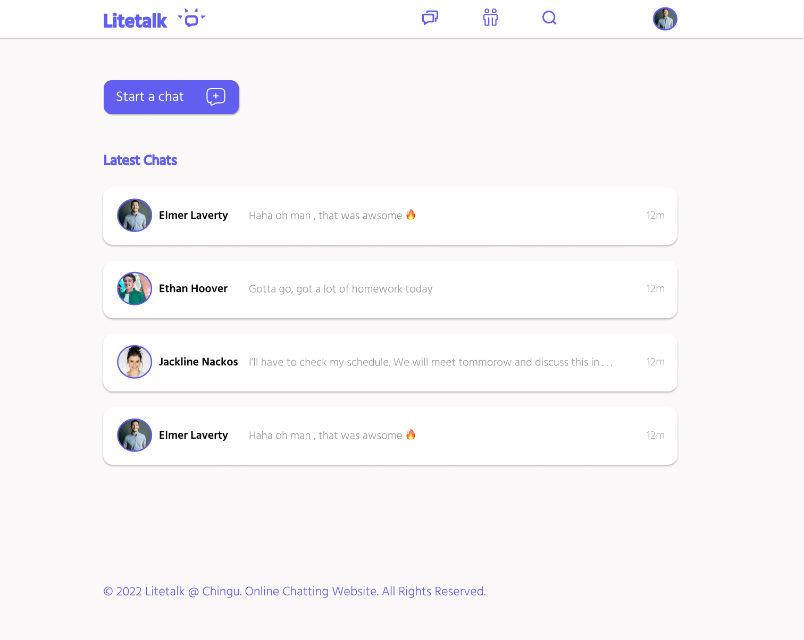

# LITETALK


<br>

## OVERVIEW 🔍🔍🔍
Litetalk is a lightweight social media app for connecting with family and friends. You can chat, share media and make calls with family and friends for free. Litetalk uses less bandwidth so it supports 2G network areas pretty well.

**Live link:** --- You can find the app [here](https://litetalk.herokuapp.com/)

<br>

## SCREENSHOTS 📸📸📸



<br>

## FEATURES ✨✨✨
The features of the `litetalk` app are -
- create user account
- chat with other users
- share media files like photos and videos
- send and receive messages in real time
- add contacts
- and many more

<br>

## DEPENDENCIES 📦📦📦
The list of dependencies used in the frontend are :

```javascript
    "@testing-library/jest-dom"
    "@testing-library/react"
    "@testing-library/user-event"
    "react"
    "react-dom"
    "react-scripts"
    "web-vitals"
    "sass"
    "react-router-dom"
    "redux-tools"
```
The list of dependencies used in the backend are :

```javascript
    "concurrently"
    "dotenv"
    "nodemon"
    "express"
    "mongodb"
    "mongoose"
```
<br>

## HOW TO RUN 🚀🚀🚀
* First, copy the url of this project
* Then open your terminal on your local computer and -
    - navigate to the location you want to create the project in (eg - home or c:/)
    - enter the command `git clone <url-of-this-project>`. Alternatively, you can provide the name of the folder you want git to clone the project to with `git clone <url-of-this-project> <name-of-folder>`
    - `cd` into the project folder
    - `cd` into the frontend folder
    - Run `npm install`
    - `cd` into the backend folder
    - Run `npm install`
    - Remain in the backend folder and run `npm run serve'

In the package.json file you will find the scripts for development and production. To be sure, for production build run `npm run build`.